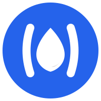

#  Kone Academy

Welcome to the official repository for **Kone Academy**, a multidisciplinary technology and innovation collective. Our mission is to empower innovators and developers at all levels by merging world-class software education and research with high-performance engineering, deploying custom digital solutions and creative services that deliver measurable results and sustainable competitive advantage to businesses.

---

## 🚀 Our Vision

Kone Academy is a multidisciplinary technology and innovation collective. We foster a powerful, global community of learners, researchers, and builders, where high-quality education and professional resources are made accessible to everyone. We blend deep educational accessibility with cutting-edge engineering, leveraging our collective talent to provide custom, high-performance digital, creative, and strategic solutions. From personalized learning pathways to commercial B2B growth platforms, we empower innovators and businesses at all levels to solve real-world problems through advanced design and computational precision.

---

## 🏛️ Core Divisions

KCA is structured into three distinct divisions, each with a specialized focus:

### 🔬 1. Research (Kone Consult)

*Formerly PHconsult*

This division is dedicated to academic and scientific research. We assist with everything from topic selection and data analysis to thesis writing and mentorship. Our goal is to empower researchers to produce high-quality, impactful work.

**[➡️ Learn More](https://philipkone.github.io/PHconsult/)**

### 💻 2. Coding (Kone Code)

The coding division offers a range of programs and courses designed to build strong programming skills. Whether you're starting your journey or looking to master advanced concepts, we have something for you.

**[➡️ Learn More](#services)**

### 🛠️ 3. Engineering (Kone Lab)

Kone Lab is where ideas turn into reality. This division focuses on practical engineering skills, including 3D modeling, design, simulation, and embedded systems like Arduino programming.

**[➡️ Learn More](#services)**

---

## ✨ Services We Offer

  

    <h3>🔬 Research (Kone Consult)</h3>
    <ul>
      <li>Research Topic Selection</li>
      <li>Data Analysis</li>
      <li>Report/Thesis Writing</li>
      <li>Mentorship</li>
    </ul>
  

  

    <h3>💻 Coding (Kone Code)</h3>
    <ul>
      <li>Python Masterclass</li>
      <li>C/C++ School</li>
      <li>R & MATLAB School</li>
      <li>Face-to-Face & Online Tuition</li>
    </ul>
  

  

    <h3>🛠️ Engineering (Kone Lab)</h3>
    <ul>
      <li>3D Modelling, Design, & Simulation</li>
      <li>Arduino Programming</li>
    </ul>
  

---

## 📝 Get Started with Kone Academy

Ready to begin your journey with us? Whether you're interested in our services or want to contribute to our open-source projects, we'd love to hear from you.

**[➡️ Service Inquiry and Signup Form](https://docs.google.com/forms/d/e/1FAIpQLSeXOBgnnnquQmQHHU1Kbyw9iYfK7gJ6Kyj5T5OctIcyy4fXSA/viewform)**

Fill out our form to register your interest, book a service, or get in touch with our team.

---

## 📄 License

This project is licensed under the terms of the [LICENSE](LICENSE) file.

---

*Kone Academy: Research, Coding, and Engineering the Right Way.*
