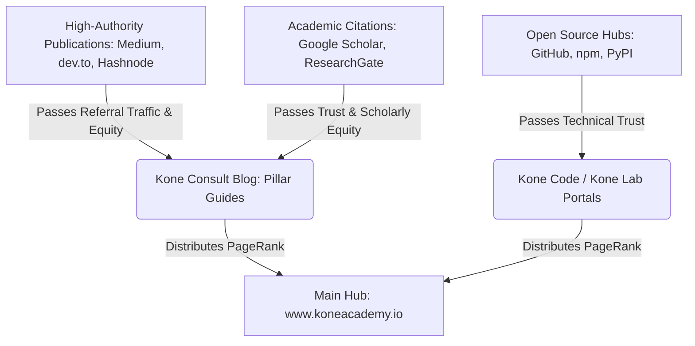

# 📢 Kone Academy PR & Backlink Strategy: Path to the Top 1%

To propel **Kone Academy** into the top 1% of global websites, we must build a high-authority backlink profile. Because we have unified our subdomains via link footers and semantic JSON-LD graphs, any backlink pointing to any subdomain will distribute authority (PageRank) across the entire ecosystem.

Here is our execution blueprint.

---

## 🎯 Domain Authority (DA) Goals
*   **Current Stage**: Crawl-optimized, entity-resolved, and technically aligned.
*   **3-Month Target**: Domain Authority **35+** (establishing initial niche authority).
*   **12-Month Target**: Domain Authority **60+** (dominating regional and academic search spaces).

---

## 🗺️ 1. The Hub-and-Spoke Backlink Architecture
We will utilize our multi-domain setup to capture authority from diverse niches:

---

## ✍️ 2. Editorial & Guest Blogging Campaigns
We will publish deep technical guides on high-DA platforms and link back to our subdomains.

### Target Platforms
1.  **Medium Publications** (Towards Data Science, JavaScript in Plain English):
    *   *Topic*: "Building Distributed IoT Telemetry Networks with ESP32 and React".
    *   *Link Strategy*: Link to [Kone Lab](https://lab.koneacademy.io/) and [Kone Shop](https://shop.koneacademy.io/).
2.  **dev.to & Hashnode**:
    *   *Topic*: "Why We Built a Custom IDE for Software Engineering Students".
    *   *Link Strategy*: Link to [Kone Code](https://code.koneacademy.io/).
3.  **Substack Newsletter**:
    *   Establish the *Kone Insights* newsletter to syndicate academic research methodology, linking back to [Kone Consult](https://consult.koneacademy.io/).

---

## 🎓 3. Academic & Trust Citation Building
Search engines place immense weight on `.edu`, `.gov`, and verified scholarly profiles.

### Action Items
*   **Google Scholar Profiles**: Ensure all consulting staff and researchers have active Google Scholar profiles listing their affiliations with **Kone Academy** and linking to `koneacademy.io` or `consult.koneacademy.io`.
*   **ResearchGate & ORCID**: Upload open-access preprints of research papers, referencing Kone Academy as the supporting institution.
*   **Wikipedia Citations**: Monitor pages related to regional agriculture, agritech, and software education in West Africa. Cite Kone Farms' research or data reports to secure high-value Wikipedia backlinks.

---

## 🛠️ 4. Technical Link Building (The Open-Source Vector)
Search engines crawl package registries heavily. We will leverage our engineering output to capture these links.

### Action Items
*   **npm & PyPI Packages**: Publish helper libraries (e.g., our custom telemetry parsers or React hooks) under the `@koneacademy` scope.
    *   Include `https://koneacademy.io` in the package `homepage` and `repository` fields in `package.json`.
*   **GitHub Organization**: Optimize the [Kone Academy GitHub Organization](https://github.com/PhilipKone) profile with links to all subdomains.
*   **Product Listings**: List the *Kone IoT Telemetry Kit* on hardware sharing sites like **Hackster.io** and **Instructables**, linking back to [Kone Shop](https://shop.koneacademy.io/).

---

## 🗓️ 5. Monthly Link Acquisition Schedule

| Week | Campaign Focus | Target Output |
| :--- | :--- | :--- |
| **Week 1** | Technical Guest Post | 1 article on dev.to/Medium linking to Kone Code/Lab |
| **Week 2** | Citation & Profile Audit | Update 5+ staff profiles (LinkedIn, Scholar, ORCID) |
| **Week 3** | Open-Source Release | Publish 1 utility package to npm/PyPI with homepage links |
| **Week 4** | Regional PR Outreach | Submit a case study on Kone Farms' IoT deployments to tech journals |
